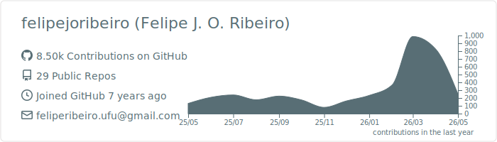
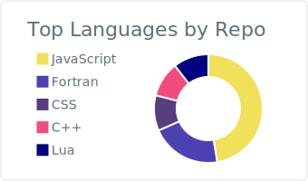
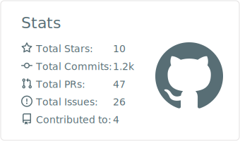
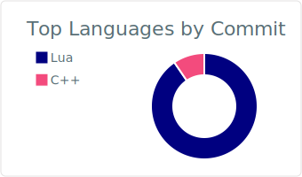

<h1 align="center" style="font-family: 'Times', sans-serif;">🌎 Hi there, i'm Felipe J. O. Ribeiro 🌎 </h1>

- 🚀 I’m currently working on:
  - Full Stack Web development.
  - Unity Game development.
  - VR and AR development.
  
- ⚡ Fun fact: I love art stuff too (that`s why there is a DeviantArt account bellow).

### Connect with me:

### Some fun projects:
- [Simple TODO](https://felipejoribeiro.github.io/simple_todo/): Developed with css, html and javascript. A place in the web to get stuff done, in a simple way.
- [Gradient BACKGROUND GENERATOR](https://felipejoribeiro.github.io/simple_back_ground_picker/): Developed with css, html and javascript. Beautiful css gradients generator.

---

](https://github.com/vn7n24fzkq/github-profile-summary-cards)

[comment]: <a href="https://github.com/anuraghazra/github-readme-stats">
[comment]:   
[comment]: </a> 

