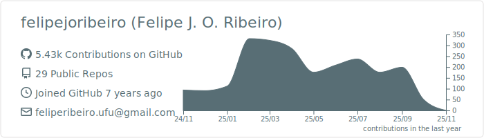

<h1 align="center">Felipe J. O. Ribeiro</h1>

- 🚀 I’m currently working on:
  - Full Stack Web development.
  - Godot Game development.
  - VR and AR technology.
  
- ⚡ Fun fact: I love drawing.

---

---

#### [Create your own private GitHub in 3 simple steps!](https://medium.com/snackin/create-your-own-private-github-in-3-simple-steps-be4663d5c8db?source=rss-4c116c57db7------2)
Make your own private Git repository today! Even better… Running only on bare minimum scripts and Git itself. A simple and informative guide.

#### [Rock stable: Watchdog-enabled Linux!](https://medium.com/snackin/rock-stable-watchdog-enabled-linux-a2b3b60ee02b?source=rss-4c116c57db7------2)
How to use Watchdog in Linux systems? Especially, with Raspberry pi zeros? Watch out for rock-stable embedded hardware on a budget!

... And more in [Medium.com](https://fejori.medium.com)

---

    
    
    <a href='https://github.com/felipejoribeiro?tab=followers'>
        
         
    </a>
    
    

